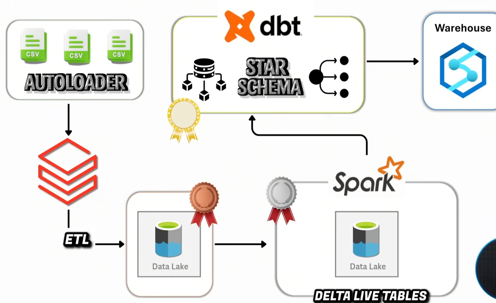
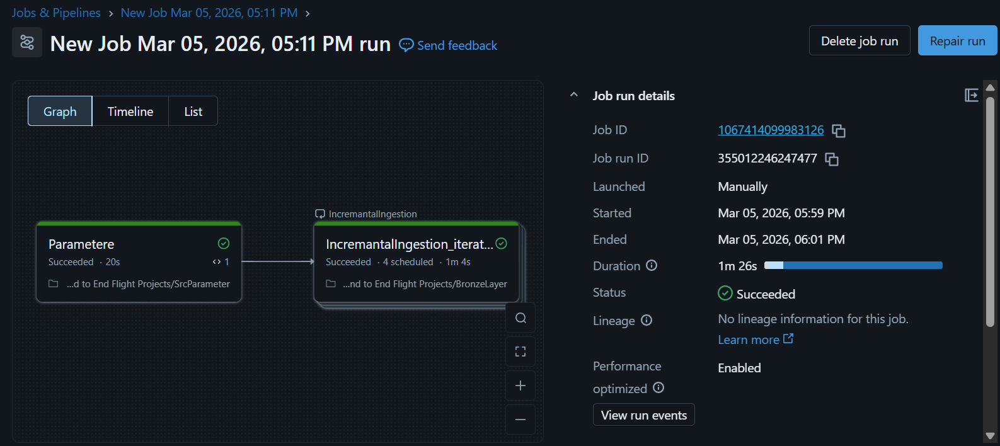
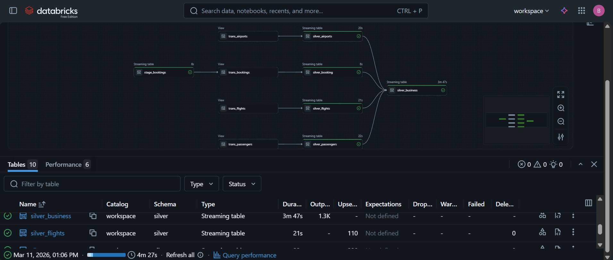
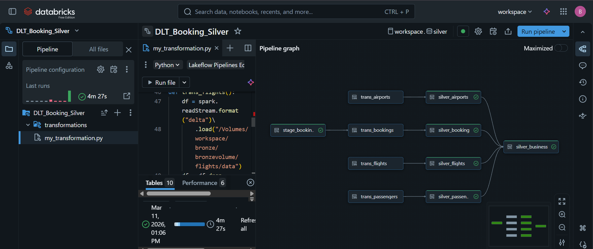
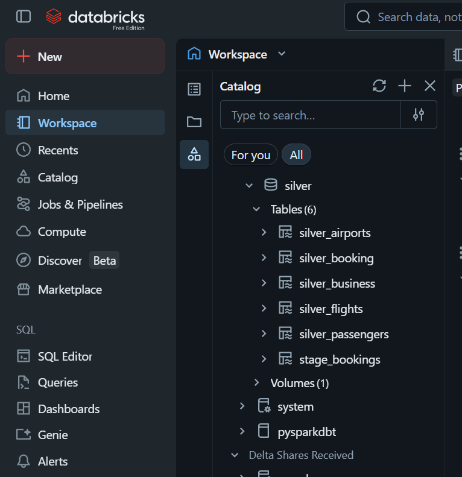
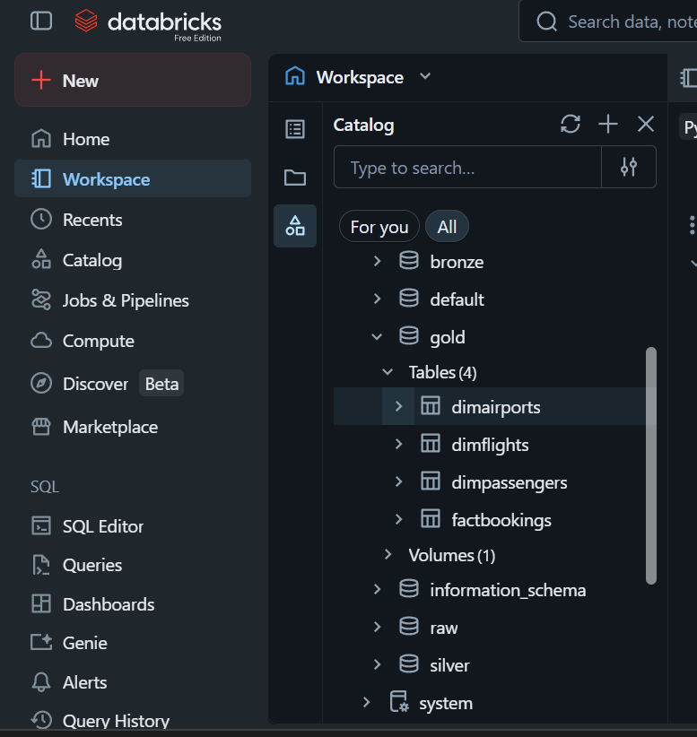

# 🚀 Real-Time Medallion Data Pipeline using Databricks
**An End-to-End Streaming ELT Pipeline with Dynamic Data Modeling**

---

## 📖 Project Overview
This project implements a scalable **Medallion Architecture (Bronze, Silver, Gold)** using Databricks to process streaming data and convert raw datasets into analytics-ready structures.

The pipeline handles **continuous data ingestion, transformation, CDC (Change Data Capture), and dynamic data warehouse modeling**, ensuring high data quality, consistency, and performance.

---

## 🏗️ Architecture Workflow
The pipeline follows a layered architecture:

→ **Bronze Layer:** Raw data ingestion using Auto Loader (Streaming)  
→ **Silver Layer:** Data cleaning, transformation, and CDC using Delta Live Tables  
→ **Gold Layer:** Dynamic creation of Fact and Dimension tables for analytics  



---

## 🛠️ Tech Stack

* **Compute:** Databricks, PySpark  
* **Streaming:** Spark Structured Streaming (Auto Loader)  
* **Transformation:** Delta Live Tables (DLT)  
* **Storage:** Delta Lake  
* **Data Modeling:** Star Schema (Fact & Dimension Tables)  
* **Language:** Python, SQL  
* **Governance:** Unity Catalog  

---

## 🚀 Key Engineering Features

---

### 📥 1. Bronze Layer: Streaming Data Ingestion

Implemented **Databricks Auto Loader** for scalable and incremental ingestion of raw CSV data.

* **Incremental Processing:** Reads only new files using streaming (`cloudFiles`)  
* **Schema Evolution:** Handles new columns dynamically using rescue mode  
* **Fault Tolerance:** Uses checkpointing for recovery and exactly-once processing  
* **Storage Format:** Data stored in Delta Lake  



---

### ⚙️ 2. Silver Layer: Data Transformation & Quality (DLT)

Built transformation layer using **Delta Live Tables (DLT)** for structured and clean data processing.

* **Data Cleaning:** Type casting, null handling, and schema correction  
* **Data Quality Rules:** Applied expectations (e.g., non-null constraints)  
* **CDC Implementation:** Used `create_auto_cdc_flow` for handling updates  
* **SCD Type 1:** Maintains latest state of data  



---

### 🔄 3. CDC Handling (Incremental Processing)

Implemented **Change Data Capture (CDC)** to process only updated records.

* Uses `modifiedDate` as sequence column  
* Supports insert and update operations dynamically  
* Avoids full data reloads  



---

### 🔗 4. Silver Business Layer: Unified Data View

Created a consolidated business table by joining multiple datasets:

* Bookings  
* Flights  
* Passengers  
* Airports  

👉 Provides a **single source of truth** for downstream analytics  



---

### 🏆 5. Gold Layer: Dynamic Data Warehouse (Core Highlight)

Designed a **dynamic and reusable framework** for building Fact and Dimension tables.

---

#### 📊 Dimension Tables

* **Incremental Loading:** Based on `modifiedDate`  
* **Surrogate Key Generation:** Using `monotonically_increasing_id`  
* **Merge Logic:** Handles insert and update using Delta Merge  
* **Audit Columns:** Maintains `create_date` and `update_date`  



---

#### 📈 Fact Table

* **Dynamic SQL Generation:** Automatically builds joins using configuration  
* **Dimension Integration:** Joins with multiple dimension tables  
* **Surrogate Keys:** Replaces natural keys for optimized joins  
* **Incremental Processing:** Filters using timestamp-based logic  


---

## 📊 Key Highlights

* Built **end-to-end real-time ELT pipeline** using Databricks  
* Implemented **Auto Loader for scalable streaming ingestion**  
* Used **Delta Live Tables for transformation and data quality**  
* Applied **CDC with SCD Type 1 implementation**  
* Designed **dynamic Gold layer for reusable data modeling**  
* Achieved **incremental processing (no full reloads)**  
* Ensured **ACID compliance using Delta Lake**

---

## 📂 Project Structure

```text
├── Databrick_Notebook/BronzeLayer.ipynb               # Auto Loader ingestion notebooks
├── Databrick_Notebook/DLTSilverLayer/                 # DLT transformation pipelines
├── Databrick_Notebook/Gold_Fact.ipynb                 # Fact logic (dynamic framework)
├── Databrick_Notebook/Gold_Dims.ipynb                 # Dimension logic (dynamic framework)
├── Project_Screenshots/                               # Architecture and output images
├── Source Flies/                                      # Sample datasets
└── README.md